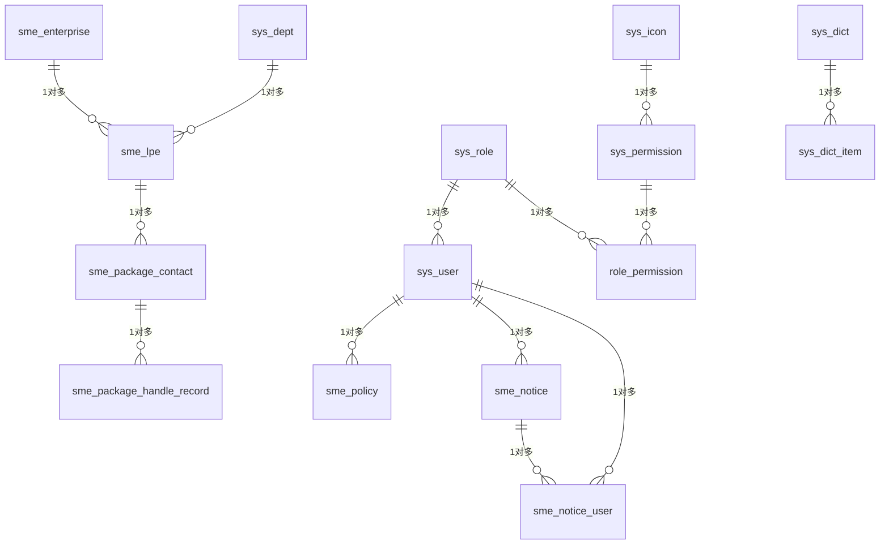

# 中小微企业服务系统数据库文档
## 文档信息
| 项目 | 内容 |
|------|------|
| 文档版本 | V1.0 |
| 数据库名称 | gh_sme_service |
| 数据库版本 | MySQL 8.0.41 |
| 字符集 | utf8mb4 |
| 排序规则 | utf8mb4_0900_ai_ci |

## 1. 数据库概述
本数据库为**中小微企业服务系统**的核心数据库，主要用于管理县域内中小微企业信息、县级领导包抓联企业工作、政策发布、通知管理、企业问题办理以及系统基础配置等业务数据，支撑中小微企业服务全流程管理。

### 核心业务模块
- 企业基础信息管理
- 领导包抓联企业及问题办理
- 政策发布与管理
- 通知公告管理
- 系统权限与基础配置管理

## 2. 数据表结构
### 2.1 核心业务表

#### 2.1.1 中小微企业表 (sme_enterprise)
| 字段名 | 数据类型 | 主键 | 自增 | 非空 | 默认值 | 注释 |
|--------|----------|------|------|------|--------|------|
| id | bigint unsigned | ✔️ | ✔️ | ✔️ | - | 主键ID |
| enterprise_name | varchar(100) | - | - | ✔️ | - | 企业名称 |
| credit_code | varchar(20) | - | - | ✔️ | - | 统一社会信用代码 |
| enterprise_type | varchar(50) | - | - | ✔️ | - | 企业类型（关联sys_dict_item，字典编码enterprise_type） |
| business_addr | varchar(255) | - | - | ❌ | '' | 经营地址 |
| legal_person | varchar(50) | - | - | ❌ | '' | 法定代表人 |
| phone | varchar(20) | - | - | ❌ | '' | 企业联系电话 |
| reg_capital | decimal(18,2) | - | - | ❌ | 0.00 | 注册资本（万元） |
| establish_time | date | - | - | ❌ | NULL | 成立时间 |
| town_id | varchar(50) | - | - | ✔️ | - | 所属乡镇（关联sys_dict_item，字典编码town） |
| industry_id | varchar(50) | - | - | ✔️ | - | 所属行业（关联sys_dict_item，字典编码industry） |
| business_status | varchar(50) | - | - | ✔️ | - | 经营状态（关联sys_dict_item，字典编码business_status） |
| main_product | varchar(500) | - | - | ❌ | '' | 主要产品 |
| enterprise_intro | varchar(1000) | - | - | ❌ | '' | 企业简介（支持富文本） |
| create_time | datetime | - | - | ✔️ | CURRENT_TIMESTAMP | 创建时间 |
| update_time | datetime | - | - | ❌ | NULL | 更新时间（自动更新） |
| del_flag | tinyint | - | - | ✔️ | 0 | 逻辑删除：0-未删 / 1-已删 |
| is_show | tinyint | - | - | ✔️ | 1 | 是否展示：1-展示 / 0-不展示 |

**约束说明**：
- 唯一约束：`uk_enterprise_name` (enterprise_name)、`uk_credit_code` (credit_code)
- 索引：`idx_enterprise_type`、`idx_town_id`、`idx_industry_id`、`idx_business_status`、`idx_del_flag`

#### 2.1.2 县级领导包抓联企业汇总表 (sme_lpe)
| 字段名 | 数据类型 | 主键 | 自增 | 非空 | 默认值 | 注释 |
|--------|----------|------|------|------|--------|------|
| id | bigint unsigned | ✔️ | ✔️ | ✔️ | - | 主键ID |
| leader_name | varchar(50) | - | - | ✔️ | - | 包抓领导姓名 |
| enterprise_id | bigint unsigned | - | - | ✔️ | - | 包联企业ID（关联sme_enterprise.id） |
| dept_id | bigint unsigned | - | - | ✔️ | - | 专班负责单位ID（关联sys_dept.id） |
| remark | varchar(500) | - | - | ❌ | '' | 备注 |
| create_time | datetime | - | - | ✔️ | CURRENT_TIMESTAMP | 创建时间 |
| update_time | datetime | - | - | ❌ | NULL | 更新时间（自动更新） |
| del_flag | tinyint | - | - | ✔️ | 0 | 逻辑删除：0-未删 / 1-已删 |

**约束说明**：
- 外键约束：`fk_lpe_dept` (dept_id → sys_dept.id)、`fk_lpe_enterprise` (enterprise_id → sme_enterprise.id)
- 索引：`idx_lpe_enterprise_id`、`idx_lpe_dept_id`、`idx_lpe_leader_name`、`idx_lpe_del_flag`

#### 2.1.3 企业包抓联问题表 (sme_package_contact)
| 字段名 | 数据类型 | 主键 | 自增 | 非空 | 默认值 | 注释 |
|--------|----------|------|------|------|--------|------|
| id | bigint unsigned | ✔️ | ✔️ | ✔️ | - | 主键ID |
| package_no | varchar(50) | - | - | ✔️ | - | 问题编号（唯一） |
| process_status | varchar(30) | - | - | ✔️ | UNHANDLED | 处理状态：UNHANDLED/HANDLING/COMPLETED/UNABLE |
| lpe_id | bigint unsigned | - | - | ✔️ | - | 关联sme_lpe.id |
| enterprise_problem | text | - | - | ✔️ | - | 企业问题描述 |
| problem_receive_time | datetime | - | - | ✔️ | - | 问题接收时间 |
| problem_type | varchar(50) | - | - | ✔️ | - | 问题类型（关联sys_dict_item，字典编码package_problem_type） |
| handle_result | varchar(50) | - | - | ❌ | NULL | 办理结果 |
| handle_content | text | - | - | ❌ | NULL | 办理情况详情 |
| unable_reason | varchar(500) | - | - | ❌ | NULL | 无法办理原因 |
| complete_time | datetime | - | - | ❌ | NULL | 办结时间 |
| handle_remark | text | - | - | ❌ | NULL | 办理说明 |
| remark | varchar(500) | - | - | ❌ | '' | 备注 |
| create_time | datetime | - | - | ✔️ | CURRENT_TIMESTAMP | 创建时间 |
| update_time | datetime | - | - | ❌ | NULL | 更新时间（自动更新） |
| del_flag | tinyint | - | - | ✔️ | 0 | 逻辑删除：0-未删 / 1-已删 |

**约束说明**：
- 唯一约束：`uk_package_no` (package_no)
- 外键约束：`fk_package_lpe` (lpe_id → sme_lpe.id)
- 索引：`idx_pkg_lpe_id`、`idx_pkg_status`、`idx_pkg_type`、`idx_pkg_time`、`idx_pkg_del`

#### 2.1.4 问题办理记录表 (sme_package_handle_record)
| 字段名 | 数据类型 | 主键 | 自增 | 非空 | 默认值 | 注释 |
|--------|----------|------|------|------|--------|------|
| id | bigint unsigned | ✔️ | ✔️ | ✔️ | - | 主键ID |
| package_id | bigint unsigned | - | - | ✔️ | - | 关联问题ID（sme_package_contact.id） |
| handle_time | datetime | - | - | ✔️ | - | 办理时间 |
| handle_content | text | - | - | ✔️ | - | 办理内容详情 |
| handle_type | varchar(20) | - | - | ✔️ | - | 操作类型：ACCEPT/PROCESS/COMPLETE/UNABLE |
| attach_url | varchar(1024) | - | - | ❌ | NULL | 附件URL（多个用逗号分隔） |
| create_time | datetime | - | - | ✔️ | CURRENT_TIMESTAMP | 创建时间 |
| update_time | datetime | - | - | ❌ | NULL | 更新时间（自动更新） |
| del_flag | tinyint | - | - | ✔️ | 0 | 逻辑删除：0-未删 / 1-已删 |

**约束说明**：
- 外键约束：`fk_handle_record_package` (package_id → sme_package_contact.id)
- 索引：`idx_handle_package_id`、`idx_handle_time`、`idx_handle_del`、`idx_handle_type`

#### 2.1.5 政策发布表 (sme_policy)
| 字段名 | 数据类型 | 主键 | 自增 | 非空 | 默认值 | 注释 |
|--------|----------|------|------|------|--------|------|
| id | bigint unsigned | ✔️ | ✔️ | ✔️ | - | 主键ID |
| title | varchar(255) | - | - | ✔️ | - | 政策标题 |
| policy_type | varchar(50) | - | - | ✔️ | - | 政策类型（关联sys_dict_item，字典编码policy_type） |
| publisher_id | bigint unsigned | - | - | ✔️ | - | 发布人ID（关联sys_user.id） |
| content | longtext | - | - | ❌ | NULL | 政策内容（富文本HTML） |
| publish_time | datetime | - | - | ✔️ | CURRENT_TIMESTAMP | 发布时间 |
| is_top | tinyint | - | - | ✔️ | 0 | 是否置顶：0-否 / 1-是 |
| is_show | tinyint | - | - | ✔️ | 1 | 是否显示：0-隐藏 / 1-显示 |
| create_time | datetime | - | - | ✔️ | CURRENT_TIMESTAMP | 创建时间 |
| update_time | datetime | - | - | ❌ | NULL | 更新时间（自动更新） |
| del_flag | tinyint | - | - | ✔️ | 0 | 逻辑删除：0-未删 / 1-已删 |

**约束说明**：
- 索引：`idx_publisher_id`、`idx_is_top`、`idx_is_show`、`idx_del_flag`、`idx_policy_type`

#### 2.1.6 信息通知发布表 (sme_notice)
| 字段名 | 数据类型 | 主键 | 自增 | 非空 | 默认值 | 注释 |
|--------|----------|------|------|------|--------|------|
| id | bigint unsigned | ✔️ | ✔️ | ✔️ | - | 主键ID |
| title | varchar(255) | - | - | ✔️ | - | 通知标题 |
| notice_type | varchar(50) | - | - | ✔️ | - | 通知类型（关联sys_dict_item，字典编码notice_type） |
| publisher_id | bigint unsigned | - | - | ✔️ | - | 发布人ID（关联sys_user.id） |
| content | longtext | - | - | ❌ | NULL | 通知内容（富文本HTML） |
| publish_time | datetime | - | - | ✔️ | CURRENT_TIMESTAMP | 发布时间 |
| target_type | varchar(20) | - | - | ✔️ | ALL | 目标用户类型：ALL/SPECIFIC_USER |
| target_value | text | - | - | ❌ | NULL | 目标用户值（用户ID逗号分隔） |
| create_time | datetime | - | - | ✔️ | CURRENT_TIMESTAMP | 创建时间 |
| update_time | datetime | - | - | ❌ | NULL | 更新时间（自动更新） |
| del_flag | tinyint | - | - | ✔️ | 0 | 逻辑删除：0-未删 / 1-已删 |

**约束说明**：
- 索引：`idx_publisher_id`、`idx_del_flag`、`idx_notice_type`

#### 2.1.7 通知-用户关联表 (sme_notice_user)
| 字段名 | 数据类型 | 主键 | 自增 | 非空 | 默认值 | 注释 |
|--------|----------|------|------|------|--------|------|
| id | bigint unsigned | ✔️ | ✔️ | ✔️ | - | 主键ID |
| notice_id | bigint unsigned | - | - | ✔️ | - | 通知ID（关联sme_notice.id） |
| user_id | bigint unsigned | - | - | ✔️ | - | 接收人ID（关联sys_user.id） |
| is_read | tinyint | - | - | ✔️ | 0 | 是否已读：0-未读 / 1-已读 |
| read_time | datetime | - | - | ❌ | NULL | 阅读时间 |
| create_time | datetime | - | - | ✔️ | CURRENT_TIMESTAMP | 创建时间 |

**约束说明**：
- 唯一约束：`uk_notice_user` (notice_id, user_id)
- 外键约束：`fk_notice_user_notice` (notice_id → sme_notice.id)、`fk_notice_user_user` (user_id → sys_user.id)
- 索引：`idx_notice_user_user_id`

### 2.2 系统基础表

#### 2.2.1 系统用户表 (sys_user)
| 字段名 | 数据类型 | 主键 | 自增 | 非空 | 默认值 | 注释 |
|--------|----------|------|------|------|--------|------|
| id | bigint unsigned | ✔️ | ✔️ | ✔️ | - | 主键ID |
| username | varchar(50) | - | - | ✔️ | - | 用户账号（登录用） |
| password | varchar(100) | - | - | ✔️ | - | 密码（BCrypt加密） |
| real_name | varchar(50) | - | - | ✔️ | - | 真实姓名 |
| phone | varchar(20) | - | - | ❌ | '' | 手机号 |
| dept_code | varchar(50) | - | - | ✔️ | - | 所属部门编码（关联sys_dict_item） |
| status | tinyint | - | - | ✔️ | 1 | 状态：0-禁用 / 1-启用 |
| create_time | datetime | - | - | ✔️ | CURRENT_TIMESTAMP | 创建时间 |
| update_time | datetime | - | - | ❌ | NULL | 更新时间（自动更新） |
| del_flag | tinyint | - | - | ✔️ | 0 | 逻辑删除：0-未删 / 1-已删 |
| role_id | bigint unsigned | - | - | ✔️ | 0 | 关联角色ID（sys_role.id） |
| avatar | varchar(1024) | - | - | ❌ | NULL | 头像URL |

**约束说明**：
- 唯一约束：`uk_username` (username)
- 索引：`idx_status_del`、`idx_dept_code`、`idx_sys_user_role_id`

#### 2.2.2 系统角色表 (sys_role)
| 字段名 | 数据类型 | 主键 | 自增 | 非空 | 默认值 | 注释 |
|--------|----------|------|------|------|--------|------|
| id | bigint unsigned | ✔️ | ✔️ | ✔️ | - | 角色ID |
| role_name | varchar(50) | - | - | ✔️ | - | 角色名称 |
| role_code | varchar(50) | - | - | ✔️ | - | 角色编码（唯一） |
| description | varchar(200) | - | - | ❌ | NULL | 角色描述 |
| create_time | datetime | - | - | ✔️ | CURRENT_TIMESTAMP | 创建时间 |
| update_time | datetime | - | - | ❌ | NULL | 更新时间（自动更新） |
| del_flag | tinyint | - | - | ✔️ | 0 | 逻辑删除：0-未删 / 1-已删 |

**约束说明**：
- 唯一约束：`uk_role_code` (role_code)
- 索引：`idx_role_status_del`

#### 2.2.3 角色权限关联表 (role_permission)
| 字段名 | 数据类型 | 主键 | 自增 | 非空 | 默认值 | 注释 |
|--------|----------|------|------|------|--------|------|
| id | bigint unsigned | ✔️ | ✔️ | ✔️ | - | 主键ID |
| role_id | bigint unsigned | - | - | ✔️ | - | 角色ID（关联sys_role.id） |
| permission_id | bigint unsigned | - | - | ✔️ | - | 权限ID（关联sys_permission.id） |
| create_time | datetime | - | - | ❌ | CURRENT_TIMESTAMP | 创建时间 |

**约束说明**：
- 唯一约束：`unique_role_permission` (role_id, permission_id)
- 外键约束：`fk_role_perm_perm_id` (permission_id → sys_permission.id)、`fk_role_perm_role_id` (role_id → sys_role.id)
- 索引：`fk_role_perm_perm_id`

#### 2.2.4 菜单权限表 (sys_permission)
| 字段名 | 数据类型 | 主键 | 自增 | 非空 | 默认值 | 注释 |
|--------|----------|------|------|------|--------|------|
| id | bigint unsigned | ✔️ | ✔️ | ✔️ | - | 权限ID |
| name | varchar(50) | - | - | ✔️ | - | 权限名称 |
| code | varchar(50) | - | - | ✔️ | - | 权限编码 |
| type | tinyint | - | - | ✔️ | 1 | 权限类型：1-菜单 / 2-按钮 |
| path | varchar(255) | - | - | ❌ | NULL | 路由地址 |
| icon_id | bigint unsigned | - | - | ❌ | NULL | 关联图标ID（sys_icon.id） |
| parent_id | bigint unsigned | - | - | ❌ | NULL | 父菜单ID |
| sort | int | - | - | ✔️ | 0 | 排序 |
| create_time | datetime | - | - | ✔️ | CURRENT_TIMESTAMP | 创建时间 |
| update_time | datetime | - | - | ❌ | NULL | 更新时间（自动更新） |
| del_flag | tinyint | - | - | ✔️ | 0 | 逻辑删除：0-未删 / 1-已删 |
| isRoute | tinyint | - | - | ✔️ | 1 | 是否为路由节点：1-是 / 0-否 |
| component_path | varchar(255) | - | - | ❌ | NULL | 前端组件路径 |
| redirect_path | varchar(255) | - | - | ❌ | NULL | 路由重定向路径 |
| active_menu | varchar(255) | - | - | ❌ | NULL | 高亮菜单路径 |
| route_name | varchar(64) | - | - | ❌ | NULL | 路由名称（唯一） |
| is_hidden | tinyint | - | - | ❌ | 0 | 是否隐藏路由：0-显示 / 1-隐藏 |

**约束说明**：
- 唯一约束：`uk_permission_path_del_flag` (path, del_flag)
- 外键约束：`fk_permission_icon` (icon_id → sys_icon.id)
- 索引：`idx_permission_status_del`、`idx_icon_id`、`idx_permission_isRoute`

#### 2.2.5 系统部门表 (sys_dept)
| 字段名 | 数据类型 | 主键 | 自增 | 非空 | 默认值 | 注释 |
|--------|----------|------|------|------|--------|------|
| id | bigint unsigned | ✔️ | ✔️ | ✔️ | - | 主键ID |
| dept_name | varchar(50) | - | - | ✔️ | - | 部门名称 |
| dept_code | varchar(50) | - | - | ✔️ | - | 部门编码 |
| parent_id | bigint unsigned | - | - | ✔️ | 0 | 上级部门ID（0为顶级） |
| leader | varchar(50) | - | - | ❌ | '' | 部门负责人 |
| phone | varchar(20) | - | - | ❌ | '' | 部门联系电话 |
| status | tinyint | - | - | ✔️ | 1 | 状态：0-禁用 / 1-启用 |
| create_time | datetime | - | - | ✔️ | CURRENT_TIMESTAMP | 创建时间 |
| update_time | datetime | - | - | ❌ | NULL | 更新时间（自动更新） |
| del_flag | tinyint | - | - | ✔️ | 0 | 逻辑删除：0-未删 / 1-已删 |
| position | varchar(50) | - | - | ❌ | NULL | 职务 |

**约束说明**：
- 索引：`idx_parent_id`、`idx_status_del`、`idx_dept_code`

#### 2.2.6 系统字典主表 (sys_dict)
| 字段名 | 数据类型 | 主键 | 自增 | 非空 | 默认值 | 注释 |
|--------|----------|------|------|------|--------|------|
| id | bigint unsigned | ✔️ | ✔️ | ✔️ | - | 主键ID |
| dict_code | varchar(50) | - | - | ✔️ | - | 字典编码（唯一） |
| dict_name | varchar(50) | - | - | ✔️ | - | 字典名称 |
| sort | int | - | - | ✔️ | 0 | 排序 |
| status | tinyint | - | - | ✔️ | 1 | 状态：0-禁用 / 1-启用 |
| create_time | datetime | - | - | ✔️ | CURRENT_TIMESTAMP | 创建时间 |
| update_time | datetime | - | - | ❌ | NULL | 更新时间（自动更新） |
| del_flag | tinyint | - | - | ✔️ | 0 | 逻辑删除：0-未删 / 1-已删 |

**约束说明**：
- 唯一约束：`uk_dict_code` (dict_code)、`uk_dict_name` (dict_name, del_flag)
- 索引：`idx_status_del`

#### 2.2.7 系统字典项表 (sys_dict_item)
| 字段名 | 数据类型 | 主键 | 自增 | 非空 | 默认值 | 注释 |
|--------|----------|------|------|------|--------|------|
| id | bigint unsigned | ✔️ | ✔️ | ✔️ | - | 主键ID |
| dict_id | bigint unsigned | - | - | ✔️ | - | 关联字典主表ID（sys_dict.id） |
| item_code | varchar(50) | - | - | ✔️ | - | 项编码 |
| item_name | varchar(50) | - | - | ✔️ | - | 项名称 |
| sort | int | - | - | ✔️ | 0 | 排序 |
| status | tinyint | - | - | ✔️ | 1 | 状态：0-禁用 / 1-启用 |
| create_time | datetime | - | - | ✔️ | CURRENT_TIMESTAMP | 创建时间 |
| update_time | datetime | - | - | ❌ | NULL | 更新时间（自动更新） |
| del_flag | tinyint | - | - | ✔️ | 0 | 逻辑删除：0-未删 / 1-已删 |

**约束说明**：
- 唯一约束：`uk_dict_id_item_code` (dict_id, item_code, del_flag)、`uk_dict_id_item_name` (dict_id, item_name, del_flag)
- 索引：`idx_dict_id`、`idx_status_del`

#### 2.2.8 系统图标库表 (sys_icon)
| 字段名 | 数据类型 | 主键 | 自增 | 非空 | 默认值 | 注释 |
|--------|----------|------|------|------|--------|------|
| id | bigint unsigned | ✔️ | ✔️ | ✔️ | - | 主键ID |
| icon_name | varchar(50) | - | - | ✔️ | - | 图标名称 |
| icon_code | varchar(50) | - | - | ✔️ | - | 图标编码（唯一） |
| icon_url | varchar(1024) | - | - | ❌ | NULL | 图标链接 |
| create_time | datetime | - | - | ✔️ | CURRENT_TIMESTAMP | 创建时间 |
| update_time | datetime | - | - | ❌ | NULL | 更新时间（自动更新） |
| del_flag | tinyint | - | - | ✔️ | 0 | 逻辑删除：0-未删 / 1-已删 |

**约束说明**：
- 唯一约束：`uk_icon_code` (icon_code)
- 索引：`idx_del_flag`、`idx_icon_code`

## 3. 数据字典
### 3.1 核心字典类型
| 字典编码 | 字典名称 | 字典项编码 | 字典项名称 | 备注 |
|----------|----------|------------|------------|------|
| enterprise_type | 企业类型 | MICRO | 微型企业 | - |
| enterprise_type | 企业类型 | SMALL | 小型企业 | - |
| enterprise_type | 企业类型 | MEDIUM | 中型企业 | - |
| enterprise_type | 企业类型 | GTGSH | 个体工商户 | - |
| town | 所属乡镇 | CHENGGUAN | 城关镇 | - |
| town | 所属乡镇 | SJJZ | 三甲集镇 | - |
| town | 所属乡镇 | QJJZ | 祁家集镇 | - |
| town | 所属乡镇 | MJXZ | 买家巷镇 | - |
| town | 所属乡镇 | QJZ | 齐家镇 | - |
| town | 所属乡镇 | ZKJZ | 庄窠集镇 | - |
| town | 所属乡镇 | SQX | 水泉乡 | - |
| town | 所属乡镇 | GFX | 官坊乡 | - |
| town | 所属乡镇 | ALMTX | 阿力麻土乡 | - |
| industry | 所属行业 | GY | 工业 | - |
| industry | 所属行业 | YW | 商贸业 | - |
| industry | 所属行业 | NY | 农业加工 | - |
| industry | 所属行业 | JXJD | 机械机电 | - |
| industry | 所属行业 | QGSP | 轻工食品 | - |
| business_status | 经营状态 | NORMAL | 正常经营 | - |
| business_status | 经营状态 | STOP | 停业 | - |
| business_status | 经营状态 | PREPARE | 筹备中 | - |
| package_problem_type | 包联问题类型 | FINANCING | 企业融资 | - |
| package_problem_type | 包联问题类型 | PERSONNEL | 人才用工 | - |
| package_problem_type | 包联问题类型 | POLICY | 政策享受 | - |
| package_problem_type | 包联问题类型 | MARKET | 市场拓展 | - |
| package_handle_result | 包联办理结果 | PENDING | 待办理 | - |
| package_handle_result | 包联办理结果 | PROCESSING | 办理中 | - |
| package_handle_result | 包联办理结果 | COMPLETED | 已办结 | - |
| package_handle_result | 包联办理结果 | UNABLE | 无法办理 | - |
| policy_type | 政策类型 | FINANCE | 金融扶持 | - |
| policy_type | 政策类型 | TAX | 税收优惠 | - |
| policy_type | 政策类型 | INDUSTRY | 产业扶持 | - |
| notice_type | 通知类型 | NOTICE | 普通通知 | - |
| notice_type | 通知类型 | WARNING | 提醒通知 | - |
| notice_type | 通知类型 | ANNOUNCE | 公告通知 | - |

## 4. 数据库关系
### 4.1 核心表关系

### 4.2 外键关系汇总
| 外键名称 | 所属表 | 外键字段 | 参考表 | 参考字段 | 级联操作 |
|----------|--------|----------|--------|----------|----------|
| fk_lpe_dept | sme_lpe | dept_id | sys_dept | id | ON DELETE RESTRICT |
| fk_lpe_enterprise | sme_lpe | enterprise_id | sme_enterprise | id | ON DELETE CASCADE |
| fk_package_lpe | sme_package_contact | lpe_id | sme_lpe | id | ON DELETE CASCADE |
| fk_handle_record_package | sme_package_handle_record | package_id | sme_package_contact | id | ON DELETE CASCADE |
| fk_notice_user_notice | sme_notice_user | notice_id | sme_notice | id | ON DELETE CASCADE |
| fk_notice_user_user | sme_notice_user | user_id | sys_user | id | ON DELETE CASCADE |
| fk_role_perm_perm_id | role_permission | permission_id | sys_permission | id | ON DELETE CASCADE |
| fk_role_perm_role_id | role_permission | role_id | sys_role | id | ON DELETE CASCADE |
| fk_permission_icon | sys_permission | icon_id | sys_icon | id | ON DELETE SET NULL |

## 5. 索引设计
### 5.1 索引设计原则
1. 主键字段默认创建聚簇索引
2. 外键字段创建普通索引，提升关联查询效率
3. 唯一业务字段创建唯一索引，保证数据唯一性
4. 常用查询条件字段创建普通索引，提升查询性能
5. 逻辑删除字段与状态字段组合创建索引，适配业务查询习惯

### 5.2 核心索引列表
| 表名 | 索引名称 | 索引字段 | 索引类型 | 用途 |
|------|----------|----------|----------|------|
| sme_enterprise | uk_enterprise_name | enterprise_name | 唯一索引 | 保证企业名称唯一 |
| sme_enterprise | uk_credit_code | credit_code | 唯一索引 | 保证统一社会信用代码唯一 |
| sme_enterprise | idx_enterprise_type | enterprise_type | 普通索引 | 按企业类型筛选查询 |
| sme_package_contact | uk_package_no | package_no | 唯一索引 | 保证问题编号唯一 |
| sme_package_contact | idx_pkg_status | process_status | 普通索引 | 按问题状态筛选查询 |
| sys_user | uk_username | username | 唯一索引 | 保证用户名唯一 |
| sys_role | uk_role_code | role_code | 唯一索引 | 保证角色编码唯一 |
| role_permission | unique_role_permission | role_id, permission_id | 唯一索引 | 保证角色-权限关联唯一 |

## 6. 权限与安全
### 6.1 角色权限体系
| 角色编码 | 角色名称 | 权限范围 |
|----------|----------|----------|
| ADMIN | 管理员 | 系统全部功能权限 |
| USER | 普通用户 | 仅查看自身相关数据 |
| DEPT | 部门管理员 | 部分业务增删查改权限 |

### 6.2 安全设计
1. 密码存储：采用BCrypt加密算法存储用户密码，不可逆
2. 逻辑删除：所有业务表均采用逻辑删除（del_flag），避免物理删除导致数据丢失
3. 外键约束：核心关联表设置外键约束，保证数据完整性
4. 唯一约束：核心业务字段设置唯一约束，避免重复数据
5. 字段长度限制：所有字符型字段均设置合理长度，防止注入攻击

## 7. 总结
1. 本数据库围绕县中小微企业服务场景设计，覆盖企业管理、包抓联工作、政策通知、系统管理四大核心模块，表结构设计符合业务逻辑且满足数据完整性要求。
2. 采用逻辑删除、外键约束、索引优化等最佳实践，保证数据安全和查询性能，同时适配业务扩展需求。
3. 数据字典标准化设计，统一了企业类型、行业、乡镇等核心枚举值，提升数据一致性和可维护性。
4. 权限体系分层设计（管理员/普通用户/部门管理员），满足不同角色的权限管控需求，符合政企服务系统的安全规范。

